# 甘肃非物质文化网站的设计与开发 / Design and Development of Gansu Intangible Cultural Heritage Website


> 更多毕设项目可跳转至项目导航栏检索：[毕设项目](http://sysadmin.3vfree.vip)，需要联系博主v：xq-lucky311，q：1047944234. 备注：项目咨询
注：由于前端项目太大，仅上传了后端代码，未包含前端代码...

## 项目简介  
基于 SpringBoot + MyBatis Plus + Shiro 的甘肃非物质文化展示平台，支持商品分类管理、订单管理、用户权限控制，实现非物质文化遗产的数字化管理与展示。

## 特征介绍  
- **权限控制**：集成 Shiro 实现用户角色权限管理，支持登录拦截和注解鉴权。  
- **高效开发**：MyBatis Plus 简化数据库操作，内置代码生成器提升开发效率。  
- **文件管理**：独立 upload 模块处理图片资源，中文文件名检测保障系统稳定性。  
- **多端适配**：分离式前端架构（admin/front），支持后台管理和前台展示双系统。  
- **工具集成**：封装百度 API 工具、MD5 加密、HTTP 客户端等常用工具类。  

## 代码结构 
```
src/
├── main/
│   ├── java/
│   │   ├── com/
│   │   │   ├── annotation/          # 权限注解
│   │   │   │   ├── APPLoginUser.java
│   │   │   │   ├── IgnoreAuth.java
│   │   │   ├── config/              # 全局配置
│   │   │   │   ├── InterceptorConfig.java
│   │   │   │   ├── MybatisPlusConfig.java
│   │   │   ├── controller/          # 接口层
│   │   │   │   ├── AddressController.java
│   │   │   │   ├── CartController.java
│   │   │   ├── dao/                 # 数据访问层
│   │   │   │   ├── AddressDao.java
│   │   │   │   ├── CartDao.java
│   │   │   ├── entity/              # 数据模型
│   │   │   │   ├── model/           # 业务模型
│   │   │   │   │   ├── AddressModel.java
│   │   │   │   │   ├── CartModel.java
│   │   │   │   ├── view/            # 视图对象
│   │   │   │   ├── vo/              # 值对象
│   │   │   ├── interceptor/         # 请求拦截器
│   │   │   │   ├── AuthorizationInterceptor.java
│   │   │   ├── service/             # 服务层
│   │   │   │   ├── impl/            # 服务实现
│   │   │   │   │   ├── AddressServiceImpl.java
│   │   │   │   │   ├── CartServiceImpl.java
│   │   │   ├── utils/               # 工具类
│   │   │   │   ├── BaiduUtil.java
│   │   │   │   ├── MD5Util.java
│   ├── resources/
│   │   ├── admin/                   # 后台前端资源
│   │   ├── front/                   # 前台前端资源
│   │   ├── mapper/                  # MyBatis映射文件
│   │   │   ├── AddressDao.xml
│   │   │   ├── CartDao.xml
│   │   ├── static/                  # 静态资源
│   │   │   ├── upload/              # 文件上传目录
│   │   ├── application.yml          # 主配置
```
## 使用说明
- **推荐浏览器**：谷歌浏览器
- **后台地址**：`http://localhost:8080/feiwuzhiwenhua/admin/dist/index.html#/login`
- **前台地址**：`http://localhost:8080/feiwuzhiwenhua/front/pages/login/login.html`
- **管理员账号**：admin / admin

### 数据库配置
编辑 `/src/main/resources/application.yml`：
```yaml
spring:
  datasource:
    url: jdbc:mysql://127.0.0.1:3306/feiwuzhiwenhua?useUnicode=true&characterEncoding=UTF-8
    username: root
    password: 123456
```

# 项目实际截图：
## 登录：
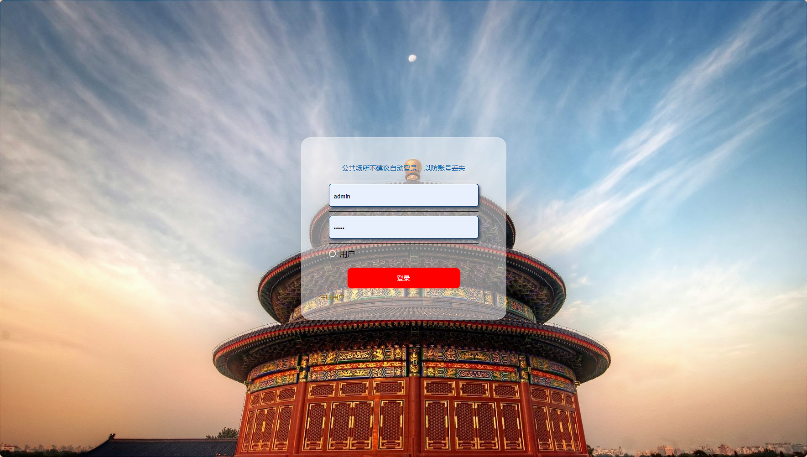

## 前台：
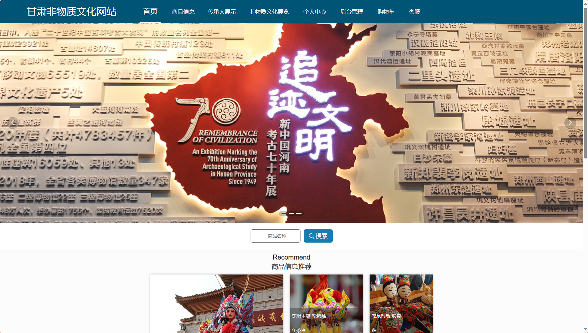
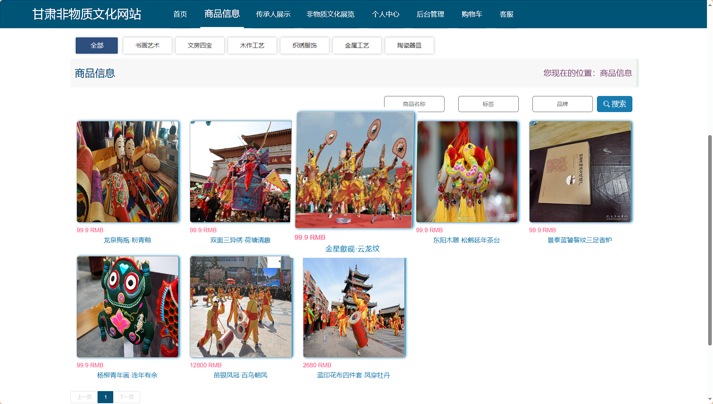


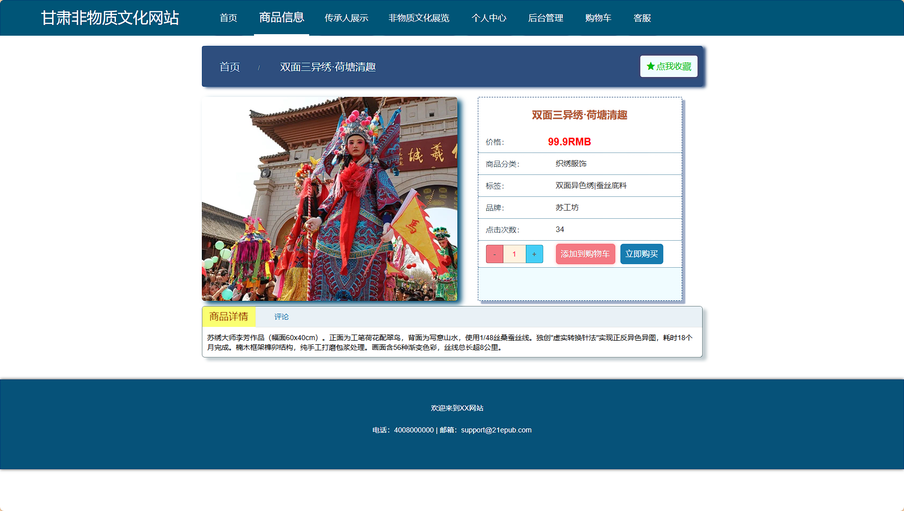
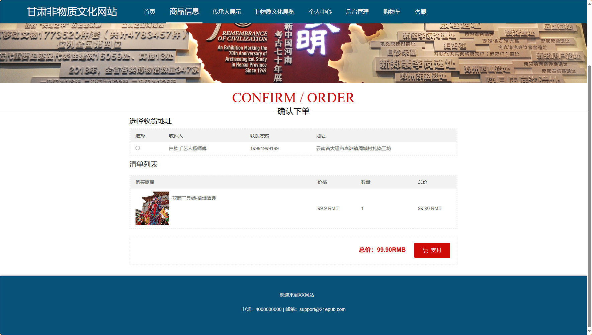
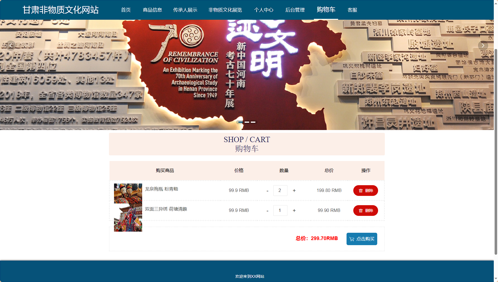

## 后台：
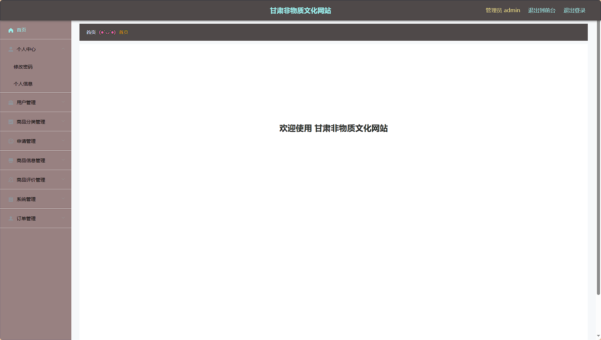
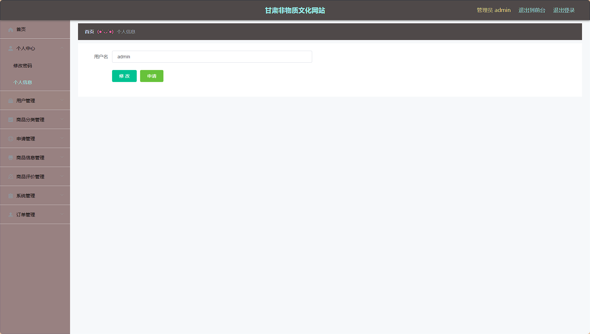
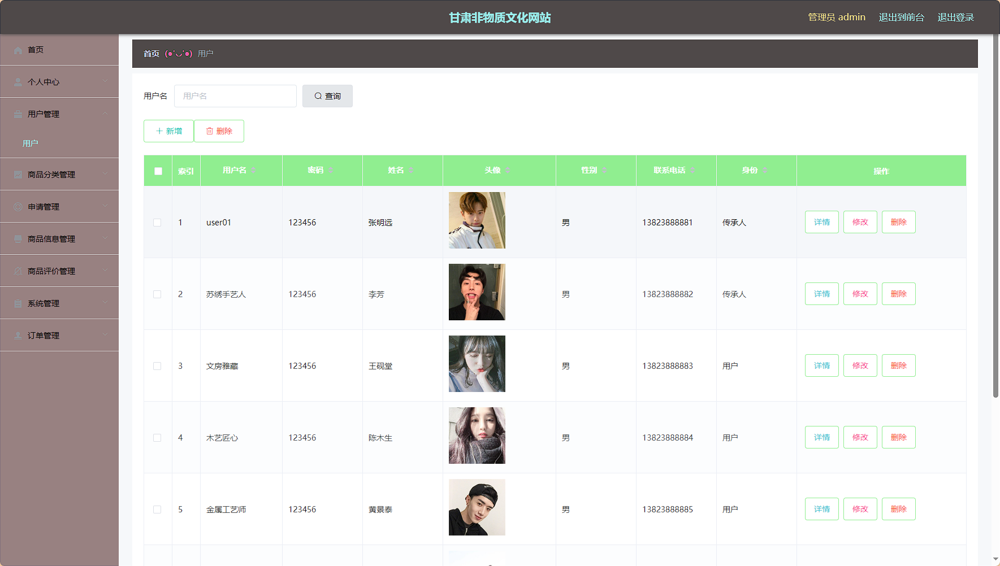
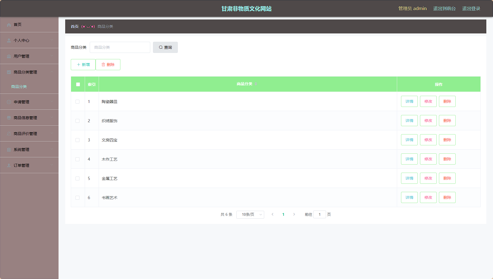
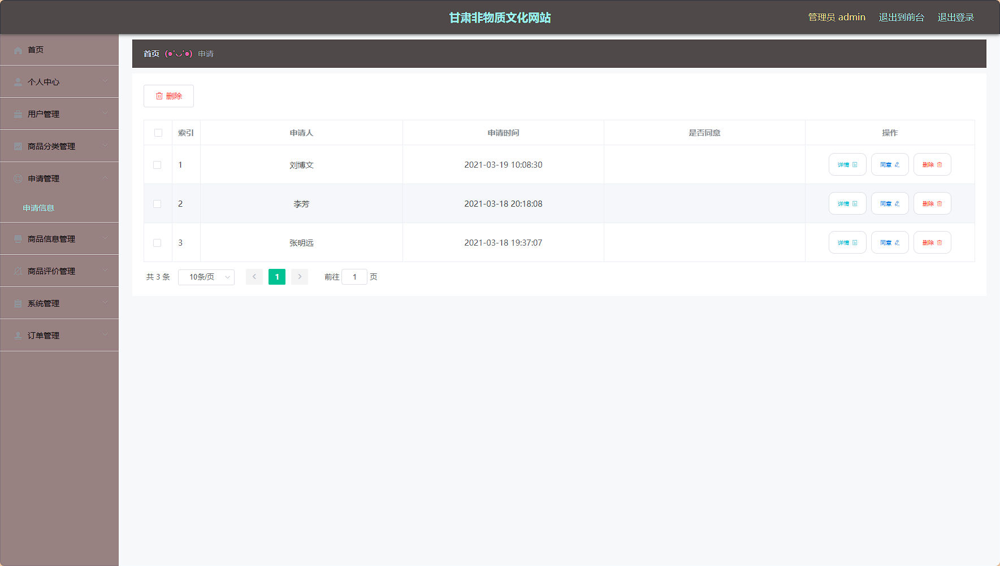
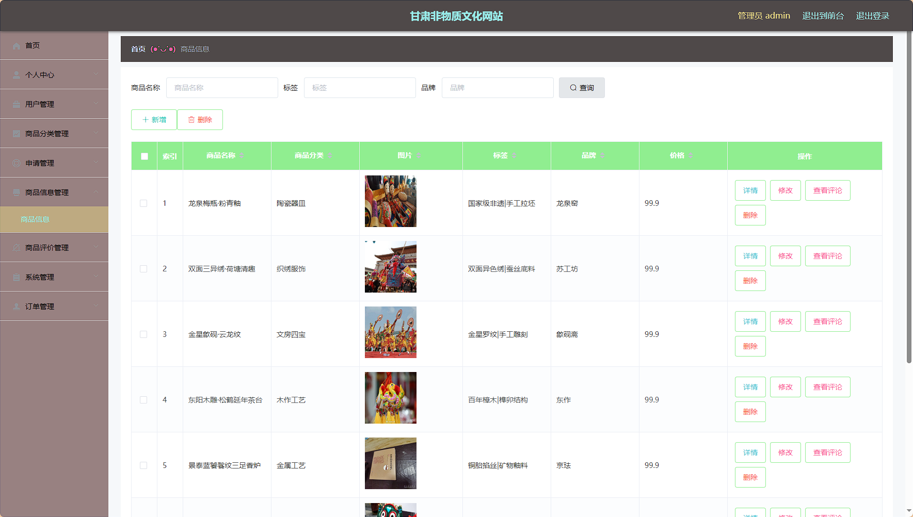
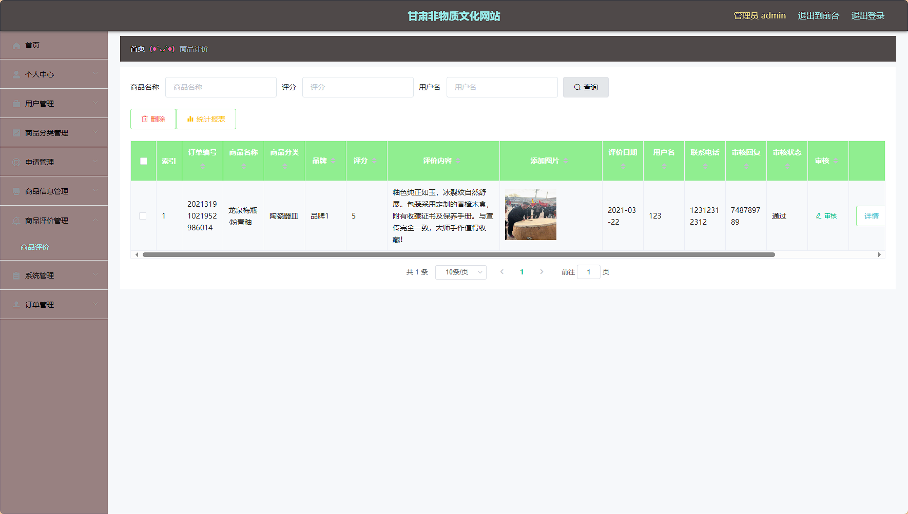
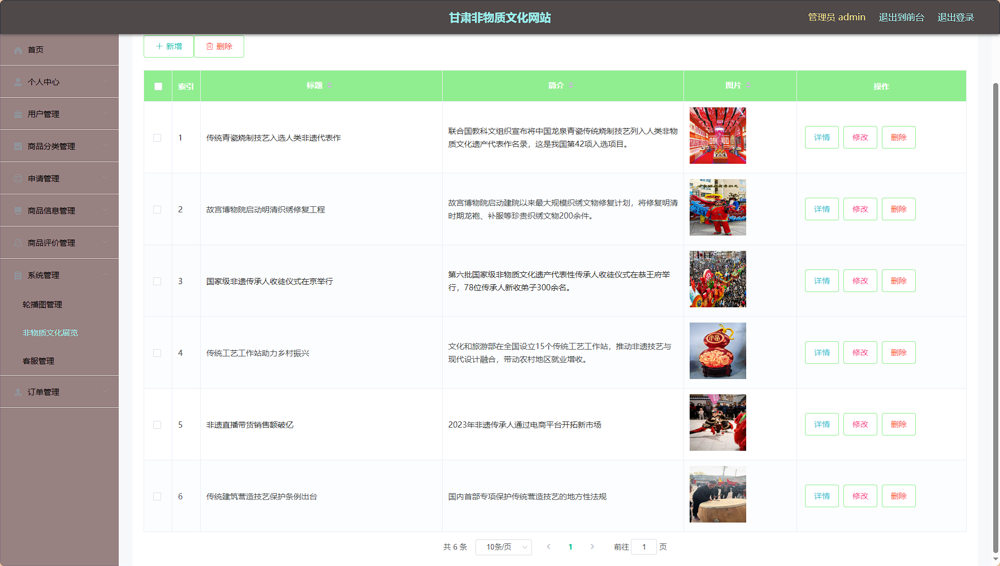
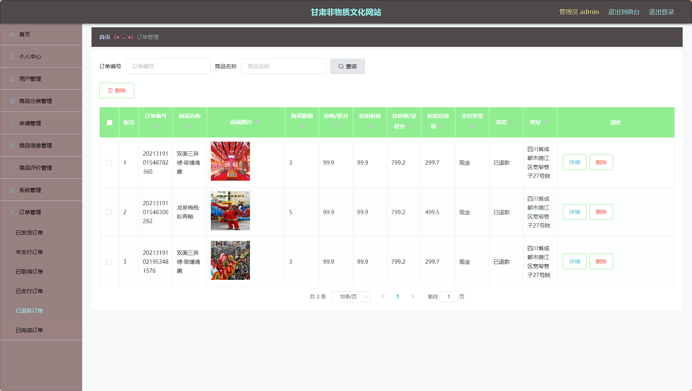

> 等等...

# 精选项目导航 & 快速部署工具
## 项目资源一站直达
- ​**访问项目导航站**：[点击进入](http://sysadmin.3vfree.vip)**快速检索所需项目名称**
- ​**技术栈全覆盖**：Java/SSm/Spring Boot/小程序等主流技术方案
- ​**配套资源**：每个项目均提供部署文档 + 演示视频（附效果截图）

### ▌导航站预览


### ▌工具界面预览


## 捐赠
> 博主将持续更新Java全栈开发项目，包含ssm，springboot，前后端分离系统等项目。
> 此外如果您够宽裕，请博主喝杯咖啡吧！捐赠将用于服务器维护与开源社区建设，感谢您的认可！
> 如需更多Java相关项目毕设3000+，有其他项目需求，sql文件等可联系博主v:xq-lucky311

---